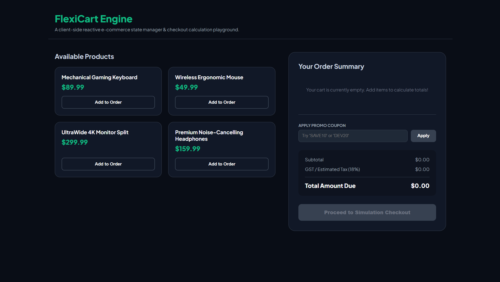

# FlexiCart — Advanced Client-Side Checkout Engine
-------------------------------------------------------
FlexiCart is a pure vanilla HTML, CSS, and JavaScript architecture utility that builds a responsive state-driven shopping cart pipeline. It maps catalog loops into document views, processes dynamic data increments, computes compound financial numbers, and hosts an active coupon matching sandbox layout.

## Preview

--------------------------------------------------------------------------
##  Technical Highlights
*  **Algorithmic Pricing Matrices:** Computes real-time dynamic sub-totals, variable coupon percentage reductions, and a flat $18\%$ tax rate bracket concurrently.
*  **Encapsulated Memory Array State:** Manages all client interface outputs strictly through unified functional data updates.
----------------------------------------------------------------------
##  Execution Instructions
1. Open `index.html` straight inside any web browser or hook it up using a VS Code Live Server extension framework.
------------------------------------------------------------------------------
